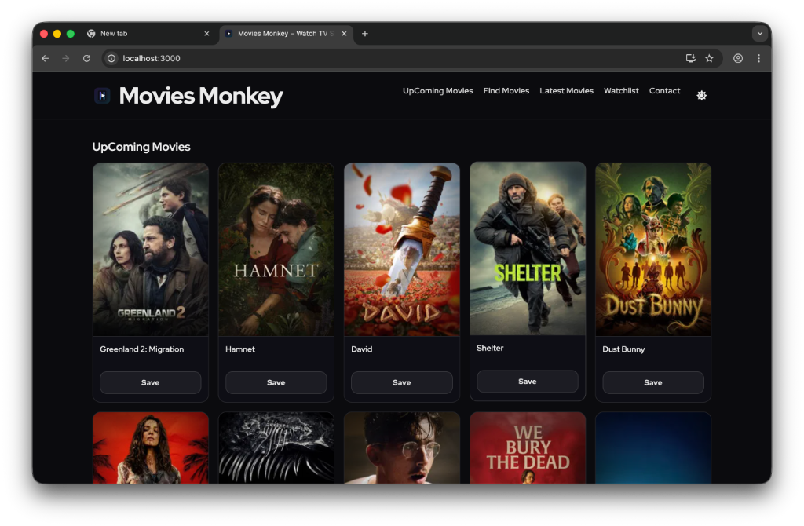
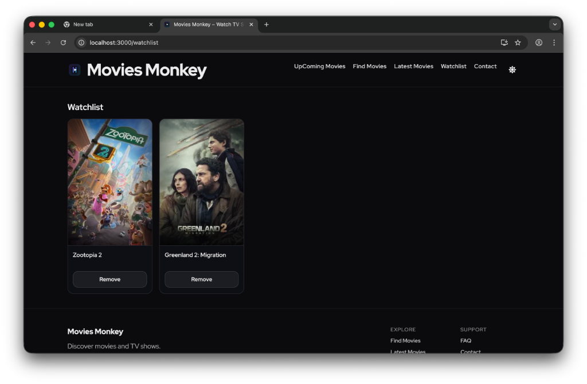

# Movies Monkey

Movies Monkey is a React-based web application designed for movie enthusiasts. It allows users to discover upcoming films, search for specific titles, and manage a personal watchlist. The application features a modern, responsive interface with both light and dark themes.

## Live Preview
[MoviesMonkey](https://mymoviesmonkey.netlify.app)

## Key Features

### 1. Upcoming Movies (Home)
The default landing page showcases the latest upcoming movies. Users can browse these titles immediately upon opening the site.


### 2. Find Movies & Genre Filter
Search for movies by name or explore by genre. The new **Genre Filter** allows users to select categories like Action, Comedy, Drama, etc., to discover movies tailored to their interests.
-   **Search**: Real-time search by title.
-   **Filter**: Dropdown menu to filter movies by official TMDB genres.

### 3. Watchlist Management
Keep track of movies you want to watch. Add movies to your watchlist from any page and manage them in a dedicated section.


### 4. Dark Mode
Toggle between Light and Dark themes for a comfortable viewing experience in any lighting condition. The toggle is conveniently located in the navigation bar.

## Tech Stack

*   **Frontend**: React.js
*   **Styling**: CSS3 (Custom Grid, Flexbox, Variables)
*   **API**: [The Movie Database (TMDB) API](https://www.themoviedb.org/documentation/api)
*   **Routing**: React Router

## Getting Started

### Prerequisites

*   Node.js (v14 or higher) and npm (v6 or higher) for local development
*   [Docker](https://www.docker.com/products/docker-desktop/) (optional, for containerized deployment)

### Installation (Local Development)

1.  Clone the repository:
    ```bash
    git clone https://github.com/ajayautade/MoviesMonkey.git
    ```
2.  Navigate to the project directory:
    ```bash
    cd MoviesMonkey
    ```
3.  Install dependencies:
    ```bash
    npm install
    ```
4.  Start the development server:
    ```bash
    npm start
    ```

### Docker Usage

This project includes a multi-stage Dockerfile for easy containerized deployment. All API keys are hardcoded for demonstration purposes in v2 images.

To build and run locally:

```bash
docker build -t moviemonkey-local .
docker run -d -p 80:80 --name moviemonkey-local moviemonkey-local
```

To pull and run the latest v2 image from Docker Hub:

```bash
docker pull ajayautade/moviemonkey:v2
docker run -d -p 80:80 --name moviemonkey-v2 ajayautade/moviemonkey:v2
```

Then visit http://localhost in your browser.

---

**Note:** For production, you should use environment variables for API keys instead of hardcoding them.

## Created By

[Ajay Autade](https://www.linkedin.com/in/ajayautadepatil/)
